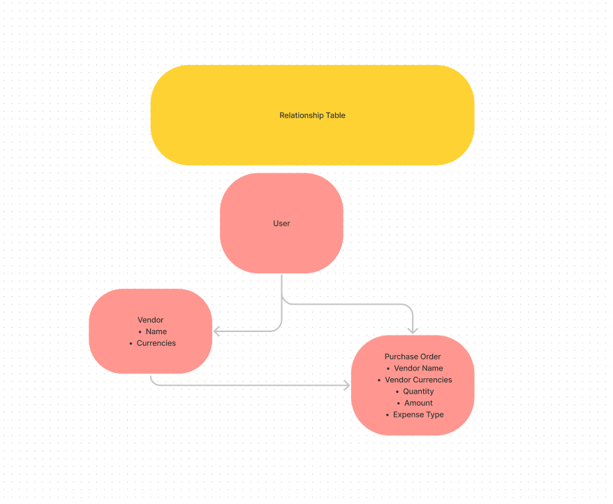
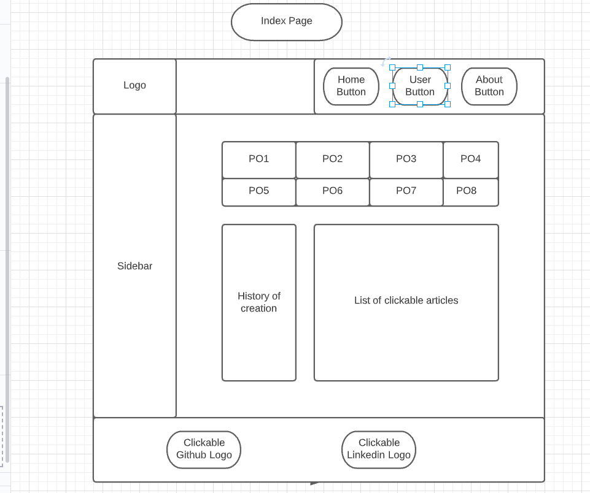
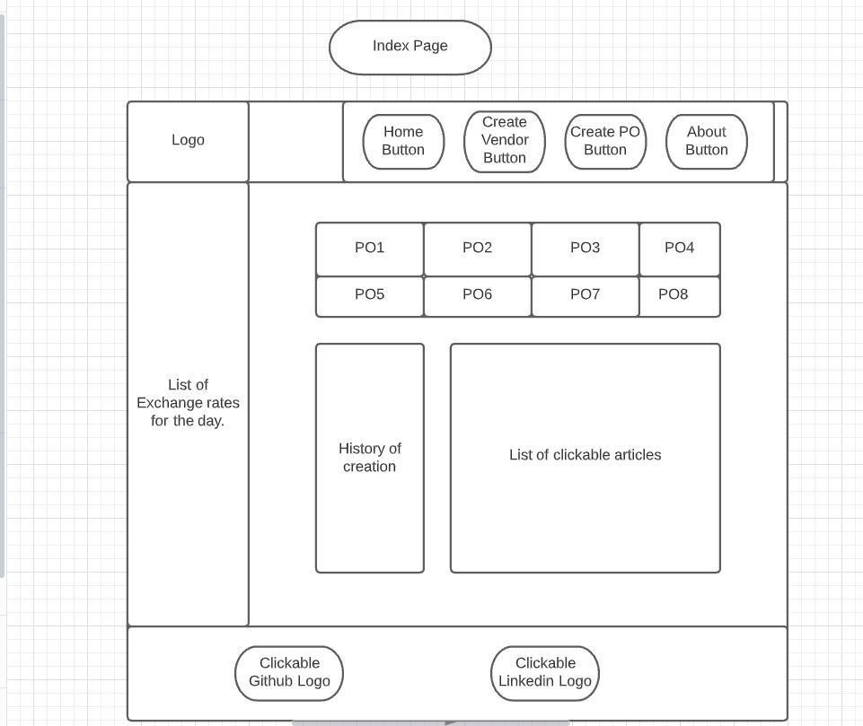
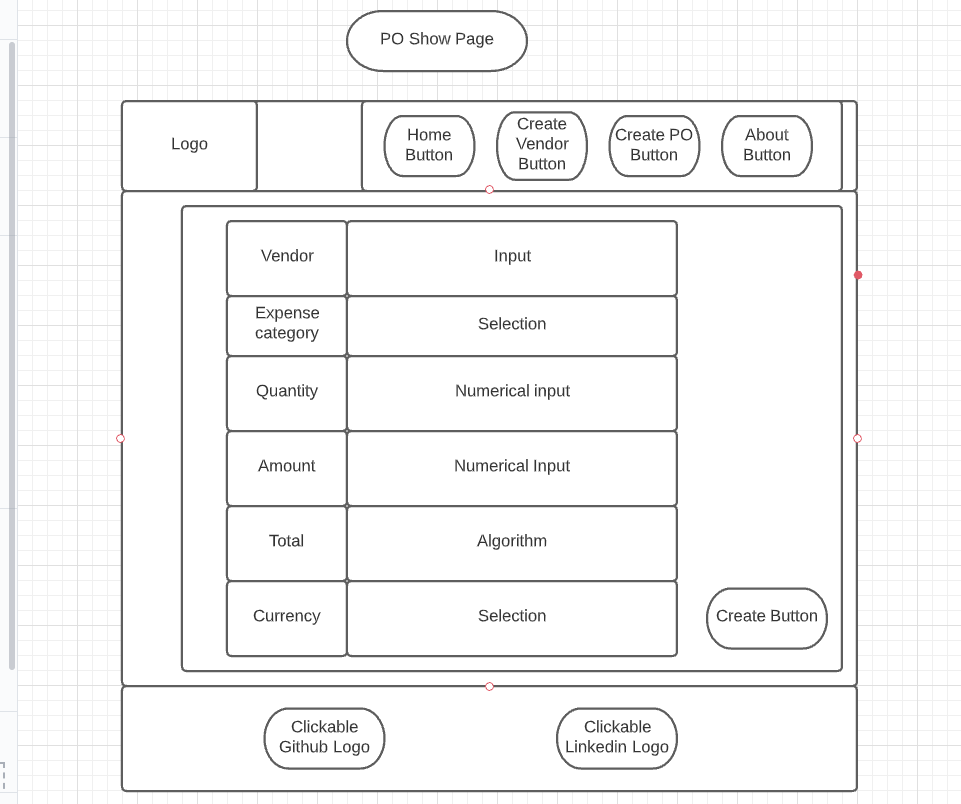
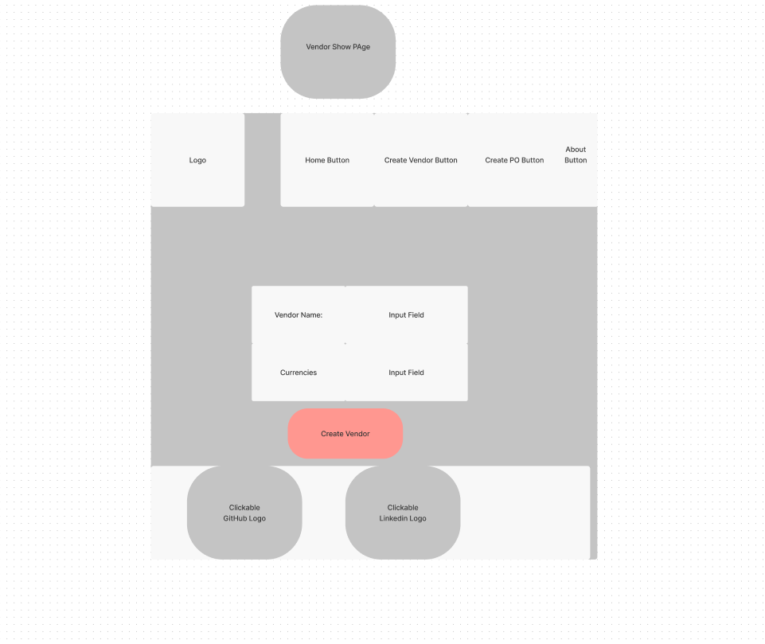

Business App
- - - -

A simply web application that allows you to create vendors and purchase orders.

Technologies Used
- - - -
* Frontend - HTML, CSS, and JavaScript
* Library - React
* Backend - Ruby on Rails
* Database - PSQL

Screen Shots
- - - -
ERD

Initial wireframe for Index Page

Wireframe for PO Page

Wireframe for Show Page

Wireframe for Vendor Index Page

Getting Started
- - - -
Frontend deployment - https://focused-babbage-5adb72.netlify.app/

Backend deployment - https://ec-business-app-server.herokuapp.com/

Future Enhancements
- - - -
- [ ] Add user authentication and authorization
- [ ] Adjust Purchase Order Schema 
- [ ] Adjust Vendor Schema to intake more fields
- [ ] Learn how to use Link in forms
- [ ] Make mobile friendly

